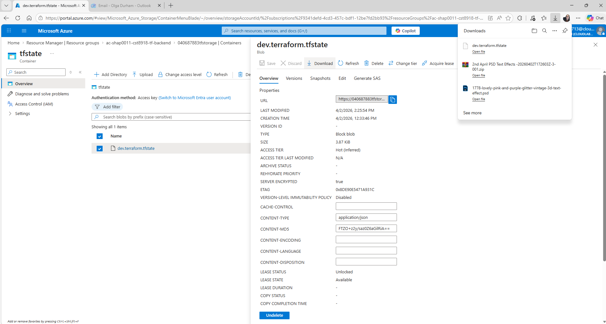

# Lab A11: Remote State Storage with Azure Blob Storage

[Link to Lab instruction](https://gist.github.com/rlmckenney/0d7fa11d66c907f6efc2bc8b8b3df2ae)

## Overview

This lab demonstrates how to configure Terraform to use **remote state storage** in Azure Blob Storage instead of storing the state file locally.

Remote state is essential in real-world DevOps workflows because it:

- enables team collaboration
- prevents state file conflicts
- improves security and reliability

---

## Technologies Used

- Terraform (~> 1.5)
- Microsoft Azure
- Azure CLI
- Azure Blob Storage
- Git & GitHub

---

## Project Structure

```
cst8918-w26-a11/
│── .gitignore
└── terraform/
    ├── main.tf
    ├── terraform.tf
    └── .terraform.lock.hcl
```

---

## Setup Steps

### 1. Create Backend Resource Group

```bash
az group create \
  --name <username>-cst8918-tf-backend \
  --location westus3
```

---

### 2. Create Storage Account

```bash
az storage account create \
  --name <unique-id>tfstorage \
  --resource-group <username>-cst8918-tf-backend \
  --location westus3 \
  --sku Standard_LRS
```

---

### 3. Create Storage Container

```bash
az storage container create \
  --name tfstate \
  --account-name <unique-id>tfstorage
```

---

### 4. Configure Terraform Backend

`terraform.tf`

```hcl
terraform {
  required_version = "~> 1.5"

  backend "azurerm" {
    resource_group_name  = "<username>-cst8918-tf-backend"
    storage_account_name = "<unique-id>tfstorage"
    container_name       = "tfstate"
    key                  = "dev.terraform.tfstate"
  }

  required_providers {
    azurerm = {
      source  = "hashicorp/azurerm"
      version = "3.96.0"
    }
  }
}
```

---

### 5. Set Access Key (PowerShell)

```powershell
$env:ARM_ACCESS_KEY="your-storage-key"
```

---

### 6. Initialize Terraform

```bash
terraform init
```

---

## Infrastructure Created

The following resources were deployed:

- Resource Group
- Virtual Network
- Subnet

`main.tf` defines:

- `azurerm_resource_group`
- `azurerm_virtual_network`
- `azurerm_subnet`

---

## Deployment

```bash
terraform plan -out=a11.tfplan
terraform apply a11.tfplan
```

---

## Verification

- Resources successfully created in Azure
- No local `terraform.tfstate` file present
- State stored remotely in Azure Blob Storage:
  - Container: `tfstate`
  - Blob: `dev.terraform.tfstate`

---

## Cleanup

```bash
terraform destroy
```

> Note: The remote state file remains in Azure for reuse.

---

## Security Notes

- Sensitive files (`.tfstate`, `.tfplan`) are excluded via `.gitignore`
- Storage account access keys should never be committed
- Access keys were rotated after use

---

## Submission Artifacts

- Screenshot of Azure Blob (`dev.terraform.tfstate`)
- Downloaded state file

---

## 📷 Azure Blob Storage State File

The Terraform state file is stored remotely in Azure Blob Storage.



---

## Key Learning Outcomes

- Configure Terraform remote backend
- Use Azure Blob Storage for state management
- Understand importance of state in Infrastructure as Code
- Apply Git best practices for Terraform projects

---

## Author

Olga Durham (CST8918 – DevOps Infrastructure as Code)
